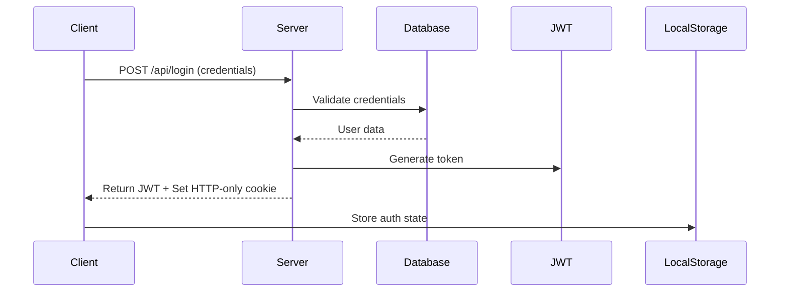

# Authentication System

## Overview

The Dental CPMS uses a custom JWT (JSON Web Token) based authentication system with secure session management. The system provides user authentication, authorization, and session persistence.

## Architecture

### 1. Authentication Flow



### 2. Core Components

#### Authentication Context (`context/AuthContext.tsx`)
- Global authentication state management
- Token handling
- Login/Logout functionality
- Session persistence

#### Middleware (`middleware.ts`)
- Route protection
- Token validation
- API request authentication
- Redirect handling

## Authentication Endpoints

### 1. Login (`/api/login`)
- **Method:** POST
- **Purpose:** Authenticate users
- **Features:**
  - Password hashing (SHA-256)
  - JWT token generation
  - Secure cookie setting
  - Session management

### 2. Register (`/api/register`)
- **Method:** POST
- **Purpose:** Create new user accounts
- **Features:**
  - Username/email uniqueness check
  - Password hashing
  - Input validation
  - User creation in database

### 3. Logout (`/api/auth/logout`)
- **Method:** POST
- **Purpose:** End user sessions
- **Features:**
  - Token invalidation
  - Cookie clearing
  - Local storage cleanup

### 4. Token Validation (`/api/validateToken`)
- **Method:** POST
- **Purpose:** Verify token validity
- **Features:**
  - JWT verification
  - Session validation
  - Token refresh handling

## Security Features

### 1. Password Security
```typescript
// Password hashing implementation
const hashedPassword = crypto
  .createHash('sha256')
  .update(password)
  .digest('hex');
```

### 2. JWT Implementation
```typescript
// JWT token generation
const token = jwt.sign(
  { userId, username },
  process.env.JWT_SECRET,
  { expiresIn: '1h' }
);
```

### 3. Cookie Security
- HTTP-only cookies
- Secure flag in production
- SameSite policy
- CSRF protection

### 4. Route Protection
```typescript
// Middleware protection
export const config = {
  matcher: ['/protected/:path*']
};
```

## State Management

### 1. Client-Side State
```typescript
const AuthContext = createContext<AuthContextType>({
  isAuthenticated: false,
  token: null,
  login: () => {},
  logout: () => {}
});
```

### 2. Session Persistence
- LocalStorage for auth state
- HTTP-only cookies for tokens
- Token refresh mechanism

## Protected Routes

### 1. Client-Side Protection
- Route guards using AuthContext
- Redirect to login for unauthenticated users
- Loading states during auth checks

### 2. Server-Side Protection
- Middleware-based route protection
- API route authentication
- Token validation on requests

## Error Handling

### 1. Authentication Errors
- Invalid credentials
- Expired tokens
- Network failures
- Session timeouts

### 2. Error Responses
```typescript
{
  success: false,
  error: {
    code: string,
    message: string
  }
}
```

## Best Practices

### 1. Security
- No token storage in LocalStorage
- Secure password hashing
- HTTPS enforcement
- XSS prevention

### 2. Performance
- Minimal token payload
- Efficient validation
- Caching considerations
- Quick response times

### 3. User Experience
- Seamless authentication flow
- Clear error messages
- Persistent sessions
- Smooth transitions

## Development Guidelines

### 1. Adding Protected Routes
```typescript
// Example of protecting a new route
export default function ProtectedPage() {
  const { isAuthenticated } = useAuth();
  if (!isAuthenticated) return <LoginRedirect />;
  return <ProtectedContent />;
}
```

### 2. API Authentication
```typescript
// Example of authenticating an API route
const response = await fetch('/api/protected', {
  headers: {
    'Authorization': `Bearer ${token}`
  }
});
```

### 3. Testing
- Unit tests for auth logic
- Integration tests for flow
- Security testing
- Performance testing

## Environment Setup

Required environment variables:
```env
JWT_SECRET=your-secret-key
NEXTAUTH_SECRET=your-nextauth-secret
NEXTAUTH_URL=http://localhost:3000
```

## Future Improvements

1. **Enhanced Security**
   - Implement 2FA
   - OAuth integration
   - Rate limiting
   - IP blocking

2. **User Management**
   - Role-based access
   - Permission system
   - User groups
   - Audit logging

3. **Session Management**
   - Multiple device support
   - Session tracking
   - Force logout capability
   - Activity monitoring 